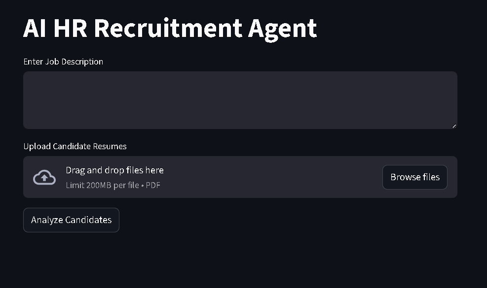
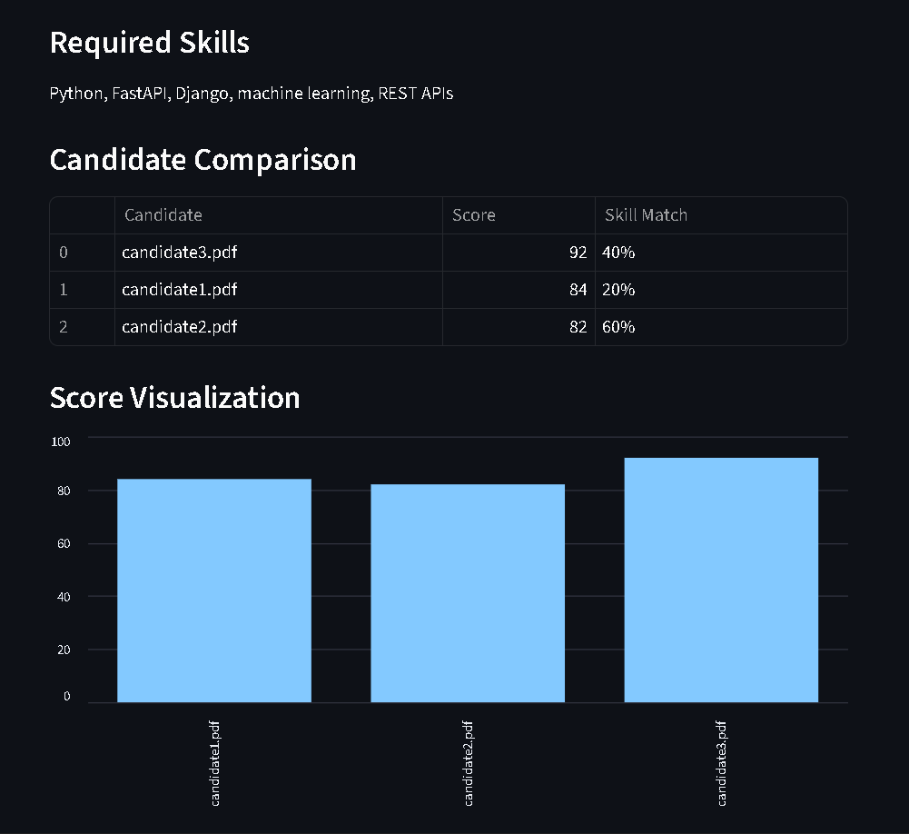
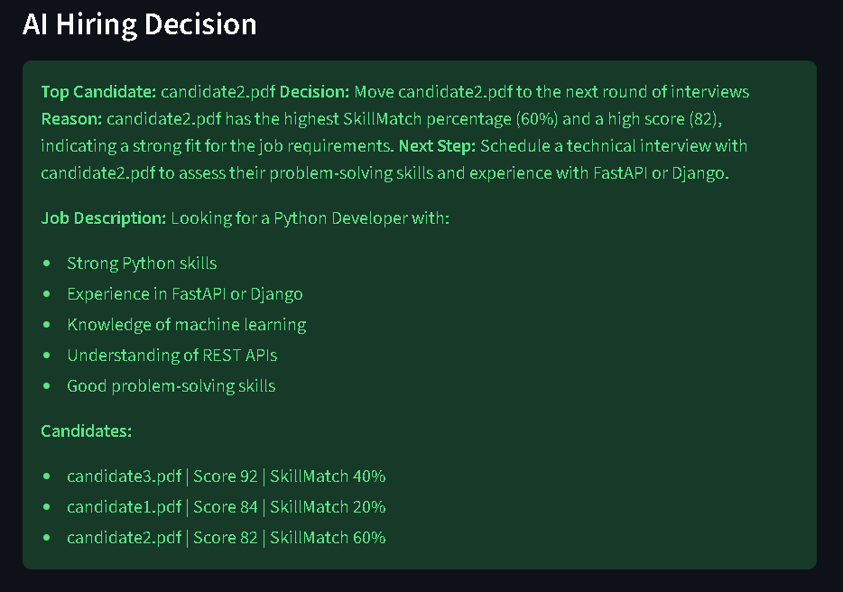
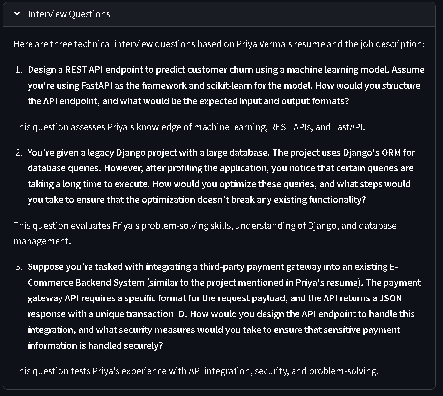

# AI HR Recruitment Multi-Agent System


An **AI-powered HR assistant** that automates resume analysis, candidate evaluation, and hiring decisions using a **multi-agent architecture powered by LLMs**.

The system helps recruiters quickly analyze resumes, identify skill gaps, rank candidates, generate interview questions, and produce hiring insights.

---

# Live Demo

Try the deployed application:

**https://ai-hr-agent-kamalsharma001.streamlit.app**

---

# Features

* Resume parsing from **PDF files**
* Resume summarization using **LLM**
* Skill extraction from **job descriptions and resumes**
* **Skill gap analysis**
* **AI-based candidate evaluation**
* Candidate **ranking system**
* **Hiring decision agent**
* **Interview question generation**
* **Hiring insights generation**
* Candidate comparison **tables and charts**
* **Downloadable hiring report**

---

# Screenshots

To demonstrate the system, we use the following example job description.

### Example Job Description

Looking for a **Python Developer** with:

* Strong Python skills
* Experience in **FastAPI or Django**
* Knowledge of **Machine Learning**
* Understanding of **REST APIs**
* Good problem-solving skills

The AI HR Recruitment Agent analyzes uploaded resumes against this job description and produces candidate evaluations.

---

### Main UI

The recruiter dashboard where users enter the job description and upload candidate resumes for analysis.



---

### Candidate Comparison

The system compares candidates based on evaluation score and skill match percentage.



---

### AI Hiring Decision

The Hiring Decision Agent recommends the best candidate based on evaluation results and provides reasoning and next steps.



---

### Interview Questions

The system generates tailored interview questions for each candidate based on the job description and resume.



---

# Multi-Agent Architecture

This project is designed as a **multi-agent AI system**, where specialized agents collaborate to evaluate candidates and assist recruiters.

### Agents in the System

**Resume Parsing Agent**

Extracts text and structured information from candidate resumes (PDF).

**Resume Summarization Agent**

Uses an LLM to generate a concise candidate summary.

**Skill Extraction Agent**

Identifies skills from resumes and job descriptions.

**Skill Gap Analysis Agent**

Compares required job skills with candidate skills to identify gaps.

**Candidate Evaluation Agent**

Uses LLM reasoning to evaluate candidate suitability.

**Candidate Ranking Agent**

Ranks multiple candidates based on evaluation score.

**Hiring Decision Agent**

Provides final hiring recommendations such as:

* Hire
* Hold
* Reject

**Interview Question Generator Agent**

Generates personalized interview questions based on candidate profiles.

**Hiring Insights Agent**

Produces insights and recommendations for recruiters.

---

# System Workflow

```
Recruiter Input
      │
      ▼
Upload Resumes + Job Description
      │
      ▼
Resume Parsing Agent
      │
      ▼
Skill Extraction Agent
      │
      ▼
Skill Gap Analysis Agent
      │
      ▼
Candidate Evaluation Agent
      │
      ▼
Candidate Ranking Agent
      │
      ▼
Hiring Decision Agent
      │
      ▼
Interview Question Generator
      │
      ▼
Recruiter Dashboard Output
```

---

# Tech Stack

### Programming Language

* Python

### Framework

* Streamlit

### AI / LLM

* Groq API

### Libraries

* Pandas
* PyPDF
* Matplotlib

---

# Project Structure

```
ai-hr-agent
│
├── app
│   ├── agent.py
│   ├── main.py
│   ├── resume_parser.py
│   ├── schemas.py
│
├── ui.py
├── requirements.txt
├── README.md
├── LICENSE
├── .gitignore
```

---

# Installation

Clone the repository

```
git clone https://github.com/kamalsharma001/ai-hr-agent.git
```

Navigate into the project

```
cd ai-hr-agent
```

Install dependencies

```
pip install -r requirements.txt
```

Run the application

```
streamlit run ui.py
```

---

# Environment Variables

This project requires a **Groq API key**.

Create a folder:

```
.streamlit
```

Inside create:

```
secrets.toml
```

Add your API key:

```
GROQ_API_KEY = "your_groq_api_key"
```

The application securely accesses the key using:

```
st.secrets["GROQ_API_KEY"]
```

---

# Deployment

This project can be deployed easily using **Streamlit Cloud**.

Steps:

1. Push the project to GitHub
2. Login to Streamlit Cloud
3. Connect your GitHub repository
4. Select `ui.py` as the entry point
5. Add your `GROQ_API_KEY` in Streamlit Secrets
6. Deploy the application

---

# Example Use Case

Recruiters can:

* Upload candidate resumes
* Provide a job description
* Automatically receive:

  * Skill gap analysis
  * Candidate ranking
  * Hiring recommendation
  * Interview questions
  * Hiring insights

This significantly **reduces manual screening effort**.

---

# Future Improvements

* Support for multiple resume formats
* Integration with ATS systems
* Advanced skill ontology matching
* Vector database for semantic search
* Multi-agent orchestration frameworks (**CrewAI / LangGraph**)

---

# Author

**Kamal Sharma**
CSE (AI & ML) – Chandigarh University

Built using **Python, Streamlit, and LLM-powered agents**.

---

# License

This project is licensed under the **MIT License**.

See the full license here:
[MIT License](LICENSE)
